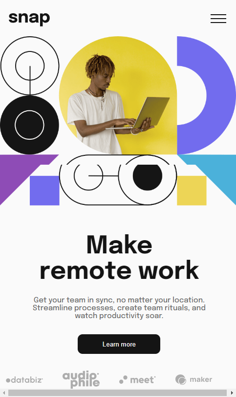

# Hello I am Mohamed Salah Web-Devolpment

# Welcome to the README file for this web development project! This file contains important information about the    project, including its purpose, how to set it up, and how to use it.

## Project Overview

This project is a web application developed using HTML, CSS, and JavaScript. Its purpose is to provide a simple and user-friendly interface for users to perform a specific task or set of tasks. The application is designed to be responsive and work well on different devices, including desktops, tablets, and mobile devices.

## Installation and Setup

To run the project locally on your machine, follow these steps:

1. Clone the project repository to your local machine using Git.
2. Open the project folder in your preferred code editor.
3. Install any necessary dependencies by running `npm install` or `yarn install`.
4. Start the local development server by running `npm start` or `yarn start`.
5. Access the application in your web browser at `http://localhost:3000` (or a different port number if specified).

## Usage

Once the project is set up and running, you can use it by following the instructions provided on the application's user interface. The application may include features such as forms, buttons, and other interactive elements that allow users to interact with it and perform the desired tasks.

## Contributing

If you would like to contribute to this project, please follow these guidelines:

1. Fork the project repository to your own GitHub account.
2. Make any necessary changes or improvements to the codebase.
3. Submit a pull request with your changes and a detailed description of what you have done.

## License

This project is licensed under the MIT License. You are free to use, modify, and distribute the code as long as you include the original copyright notice and license terms.

### Screenshot

.png)
.png)

### Links

- Solution URL: (https://github.com/Mohamedsalahmsa/Expenses-chart-component/)
- Live Site URL: (https://github.com/Mohamedsalahmsa/Expenses-chart-component/)

